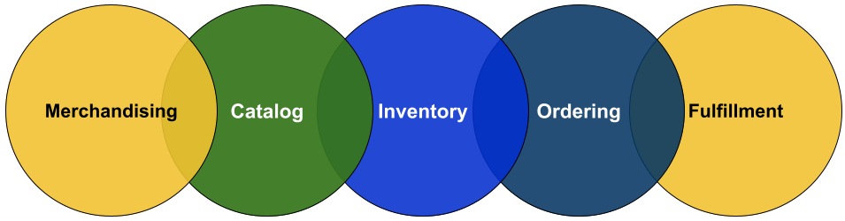
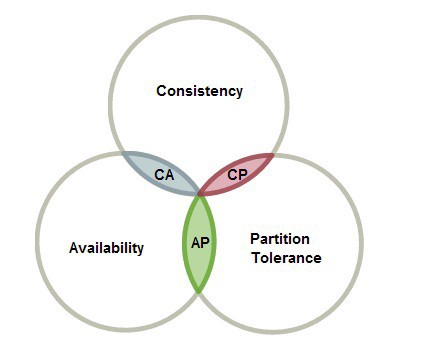
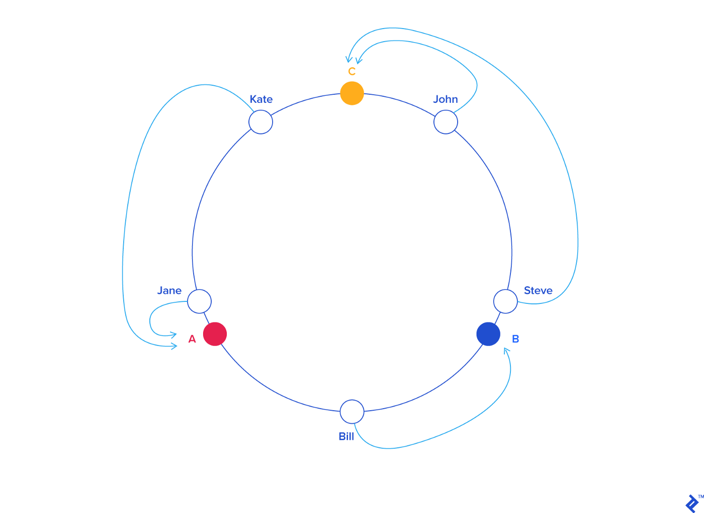
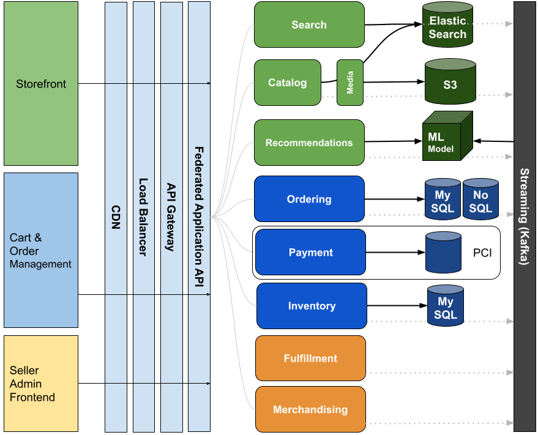

# Design Amazon, an e-commerce system

## Challenge

How would you approach a system design problem that requires you to design the core e-commerce system like that of Amazon?

### Functional Requirements
Sellers list products and availability. Shoppers search, shop, purchase and receive relevant recommendations.

### Scale
The platform is expected to hold 100 million unique SKUs, 300 million registered customers, 1.5 million sellers, and handle 1 million orders on an average day.

# Proposal
Author: @IbrahimZananiri

## System objectives
This problem statement is quite large. We will approach it from a few core angles that stands up an e-commerce platform.

We will touch on identity, product search and discovery, inventory management, and order handling. We will make and rationalize a few key technical decisions as well.

As this problem is large, for the sake of practicality, we will be simplifying a lot than what one can actually do in case you were to build the real Amazon.

## Core Building Blocks of Data
1. Product: SKU, images, description. One product can be sold by multiple Sellers and can be located in different Warehouses.
2. Inventory Item: Product, Seller, Availability, Warehouse
2. Merchandisable Item: Product, Seller, Cost, Price, Inventory Info
3. Order: LineItems, Address, Customer, Order Status, etc
4. Address: Street, City, State, Zip Code, Country, Coordinates, Phone
5. User: Email, Name, Can be a Customer and/or a Seller
6. Customer: User, Addresses, Payment Instruments
7. Seller: User, Merchant Info, Warehouses

## Capacity Planning

- 301.5m users * 10kb/user metadata on average = ~2.8TB
- 300m customers * 25kb/customer metadata on average = ~7TB
- 1.5m seller * 50kb/seller metadata on average = 71.5GB
- 100m products * 100kb/product metadata = 9.3TB
- 100m * 2 Merchandisable Items/product on average * 10kb = ~2TB
- 1m orders/day * 365 days * 25kb = 8.5 TB order data/year

## Core Domains
Core domains in an e-commerce problem like that of Amazon have been relatively well-defined throughout the years.

Figure: E-Commerce Core Domains to build a seller-buyer platform like Amazon

Some of the bounded context domains within this problem, think Domain-Driven Design (DDD), are:

- **Catalog**: Manage product metadata and associated media content
- **Inventory**: Manage availability, warehouse location, backordering
- **Merchandizing*8: Product Pricing, Placement and Promotions
- **Ordering**: Order placement and management
- **Payment**: Payment instrument handling, charges. PCI.
- **Fulfillment**: Shipment picking, delivery and tracking
- **Identity**: Identity management and access control
- **Seller Management**: Seller metadata, and management of seller inventory
- **Analytics**

## Data Store Choices: CAP theorem tradeoffs

Diagram: [Source](https://towardsdatascience.com/cap-theorem-and-distributed-database-management-systems-5c2be977950e)

### CAP Theorem Refresher
CAP Theorem states that any distributed system can have at most two of the following three properties:
- **C**: Consistency
- **A**: Availability
- **P**: Partition tolerance

## Product Storage
Needs to be horizontally scalable and highly available; AP out of CAP. 
High read/write ratio. Product attributes can diverge by product family, requiring a flexible structure.

Based on the above, Product metadata such as SKU, name, description, localizations, and dimensions (excluding product media images/videos storage) can go into a document store that supports flexible query forms, and to support text-based search. ElasticSearch can be considered.

## Multimedia Storage
Product images and videos are relatively larger and would require a cost-efficient, highly-available store to persist those files. Cloud blob storage comes into play here, like **AWS S3**, **Google Cloud Storage**, or **Azure Blob Storage**. These services provide cheap, replicated and hence HA storage for object storage.

**Content Delivery Network**: For optimizing latency, CDN such as **Cloudfront**, **Akamai** or **CloudFlare** can be placed in front of static resource stores to provide a distributed network of nodes that cache your resources, serving user requests from the closest nodes, via the most optimal routes.

## Inventory Storage
For inventory, a.k.a. Sellable Items, the need is clear for consistency in how data is managed; CP out of CAP.
Inventory data enjoys a well-defined, generally stable structure.

As such, Inventory Sellable Items’ data management requires ACID guarantees, which can be offered by an RDBMS like **Postgres**, **MySQL**, **Oracle**, or **MS SQL Server**.

## Order Storage
A submitted Order is an entity composed of different elements of data and references, i.e. relations. Orders carry state info, data which would be required to handle, fulfill, pick, ship, or cancel the order.
Consistency is required, at least until the order is completed, reaching an end state (e.g. delivered or canceled); and hence, CP. As in the case of Inventory, an RDBMS would serve us very well for storing and managing orders.

## Scale RDBMS with Sharding and Consistent Hashing
RDBMS are generally more difficult to scale horizontally than NoSQL stores, but one common technique is to implement sharding. We can shard data by a shard key, like Order ID, and utilize Consistent Hashing for smoothened scaling up and down. Looking up a shard by entity ID would take Log(N) time where N is the number of nodes in the ring.

Figure: Consistent Hashing is a distributed hashing scheme that works independently of the number of servers or objects. Source: [A Guide to Consistent Hashing — TopTal](https://www.toptal.com/big-data/consistent-hashing)

### Potential Optimization
For orders that get completed, one optimization that can be considered is to move those to a more readily scalable, and highly available system as strict consistency becomes less of a concern making eventual consistency acceptable. **Wide-column NoSQL** solutions can be considered here, like **Cassandra** or **DynamoDB**.

## Identity Storage

Customer and seller data like email, hashed password and roles enjoys a well-defined structure, does not change often, and is queried in well-defined ways. For scale and high availability, a NoSQL storage solution like Cassandra or Google BigTable can come in handy. An RDBMS solution also should work just fine as long as you manage to scale such a database.

## Architecture
Key architectural decisions for the e-commerce system:

## Layered Architecture
Layered architecture a common architecture pattern. Components are grouped into layers, where each layer performs a specific role within the overall system.
Each layer is isolated and independent of the other layers, having no knowledge of the inner workings of other layers in the system. Well-defined APIs are exposed to be used by, exclusively, the higher layers.

Figure: Layered Architecture with isolated layers communicating from left to right.

The layers in our architecture are:

1. **Presentation**: User Interfaces
2. **HTTP**: Load balancing, Rate Limiting, API Gateway, Authentication, etc
3. **Application API**: Federated API to enable different product use cases by communicating with core domain services to
4. **Core domain services**
5. **Data Stores**

## Modern Frontends
Built on top of Declarative UI libraries, and powered by common design elements, utilizing MVVM or Flux. React, SwiftUI and Jetpack Compose are great choices for building such clients.

## Streaming Backbone
Common Kafka component powers event-driven interactions between domains, as well as common platform use-cases of Analytics, Stream Processing and Big Data storage.

## Putting it all together

## Additional Architecture Patterns

### Core domain interfaces
gRPC for core domain interface definition would enable modern, low-overhead RPC communication between services with streaming capabilities, provides a clean mechanism of management for service contracts, as well as easy code generation for multiple languages and platforms.

### Event Sourcing
Event sourcing is pretty similar to how accountants do their work. This architecture pattern allows you to maintain an audit trail and be able to replay or reverse events to bring your system to a desired state. Can Event Sourcing be utilized for Cart Management?

### Remember
The “perfect” architecture for a given problem does not exist. In practice, System Architecture is an open activity that you’d iterate on continuously as the needs of your platform evolve and learnings from earlier design are accrued.

### Source
This proposal first appeared on Ibrahim's post:
[Design Amazon E-Commerce System](https://medium.com/@ibrahim.zananiri/design-amazon-e-commerce-system-7f2dd57637bb)

---

## Submit Your Proposal

Create a PR with you proposal.

1. Create your `proposals/{YOUR_GITHUB_USERNAME}/` directory
2. Write your proposal in README.md under that

For images, create `images/` under your folder and place your images under that.