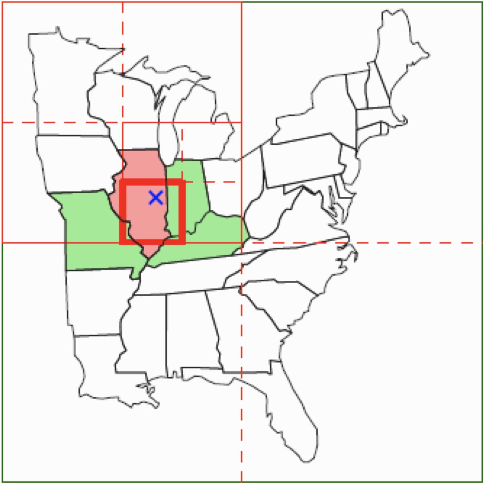
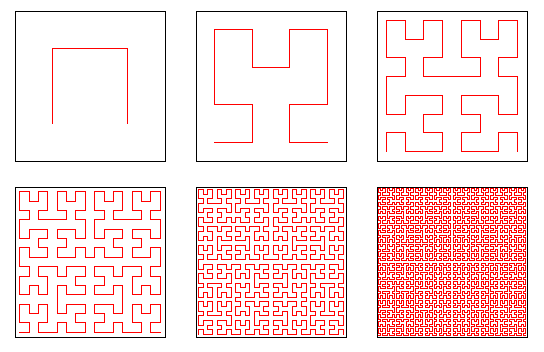
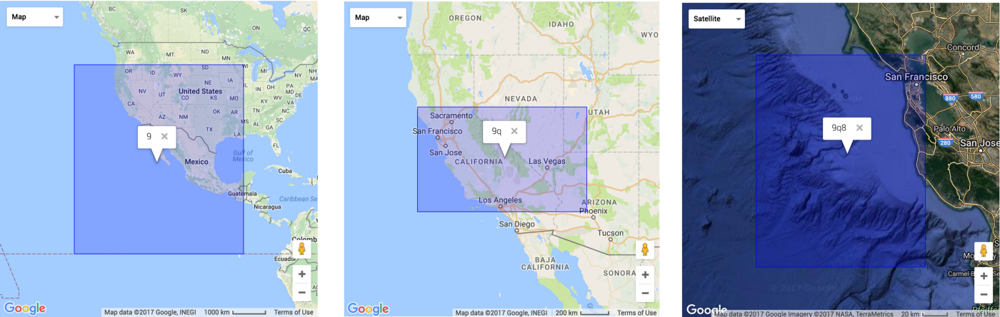
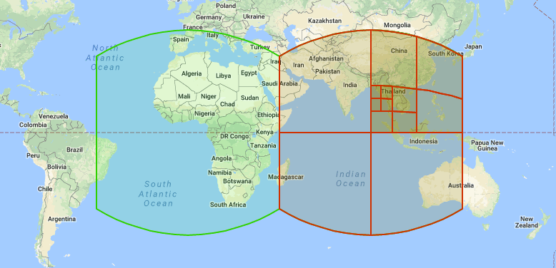
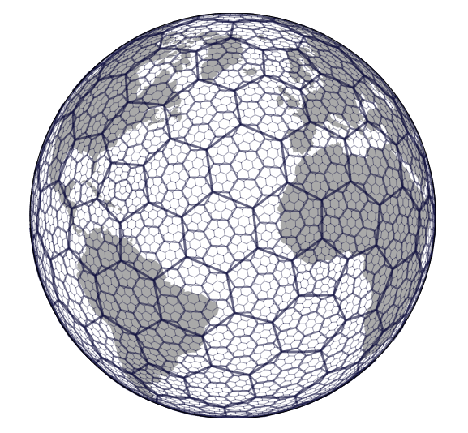

# Search Nearby Places

## Challenge

Searching for nearby places within walking distance, restaurants within your vicinity, or hailing nearbt cab drivers. All are use-cases that require proximity search in one way or another.

Consumer apps we use today, like Google Maps and Uber use proximity search to enable their core features. They are blazing fast and manage to complete our request within a fraction of a second!

How would you be able to achieve fast proximity-based search?

How would you structure your data and index places for efficiency?

How can you scale to hundreds of millions of places and concurrent requests?

# Proposal

This proposal includes five approaches to solving proximity search challenges.

Search within a 1-dimensional range is easy. Search on a 2-dimensional plane is harder.

## Searching for a range within 1-dimensional space
Searching for a range within a list of 1-dimensional elements is relatively well understood and established. Our options for data structures that enable this are generally:

- **Unordered Array** \
Inserts: O(1), fast | Search: O(N), linear and slow
- **Ordered Array** \
Inserts: O(N), slow | Search: O(LogN + R), improved with binary search
- **Balanced Binary Search Tree** \
Inserts: O(LogN), improved | Search: O(LogN + R)

Where N is the number of objects in the overall search space, and R is the number of matched objects in the range.

This is nicely explained by Professor Robert Sedgewick in [1d Range Search](https://www.coursera.org/lecture/algorithms-part1/1d-range-search-wSISD), Algorithms Part I, Princeton University.

## Searching for objects in a 2-d space
Given a center location point, find K objects that are not further away than D distance units, i.e. within a given radius. Your implementation should be efficient in terms of time and space complexity.

### Naive Approach
Store all objects in memory, iterate over them all, compute Euclidean distance from center point, and determine whether it is within D distance.

This is clearly O(N) time. Imagine Google Maps’ backend requiring to load and iterate over a list that comprises the whole world’s restaurants just to be able to answer your query of nearby restaurants in your proximity. This is very inefficient.

Can we do better? Definitely, Read on…

### Quadtree
What?! A quadtree is a spatial tree data structure in which each node has exactly four children. A child node can either be a limited list of objects, or a list containing four inner sub-quadtrees.


Diagram: A Quad Tree represented by grid on a map. [Source](https://www.cs.tau.ac.il/~haimk/seminar12b/Quadtrees.pdf)

Inserts and search are generally logarithmic, Log(N), or height of the tree, where N is the total number of nodes in the tree.

Some code makes it easy to understand Quadtrees. Here is the node class:

```java
public class QuadTree {
  private static final int MAX_POINTS = 3;
  private Region area;
  private List<Point> points = new ArrayList<>();
  private List<QuadTree> quadTrees = new ArrayList<>();
  public QuadTree(Region area) {
    this.area = area;
  }
}
```

Search using recursion as we traverse our Quadtree starting from root:

```java
public List<Point> search(Region searchRegion, List<Point> matches) {
  if (matches == null) {
    matches = new ArrayList<Point>();
  }
  if (!this.area.doesOverlap(searchRegion)) {
    return matches;
  } else {
    for (Point point : points) {
      if (searchRegion.containsPoint(point)) {
        matches.add(point);
      }
    }
    if (this.quadTrees.size() > 0) {
      for (int i = 0; i < 4; i++) {
        quadTrees.get(i).search(searchRegion, matches);
      }
    }
  }
  return matches;
}
```

More code on [Range Search Algorithm in](https://www.baeldung.com/java-range-search) Java at Baeldung.

### Space-Filling Curve
In simple terms, a space-filling curve is just a line that is bent around in a predetermined fashion until it fills a 2-dimensional plane. This line can be bent recursively to form multiple iterations of depth into smaller and smaller areas.


Diagram: First six iterations of a Hilbert Curve. [Source](https://en.wikipedia.org/wiki/Hilbert_curve)

This is a way to convert a given 2-D space into a 1-D continuous line which allows simple and efficient geospatial queries, enabling you to assign 1d numbers to objects. This consequently converts the proximity 2d search problem into the simple 1d search that we know.

Once objects are sorted into this ordering, any one-dimensional data structure can be used, such as binary search trees, B-trees and Hash Tables.

### Geohashing
*Geohash* is a hierarchical spatial data structure which subdivides space into buckets of grid shape, which is one of the many applications of what is known as a Z-order curve, and generally space-filling curves.


Diagram: What is geohashing exactly? [Source](https://medium.com/@bkawk/geohashing-20b282fc9655)

We can change the size of the area by specifying the number of characters in the hash from 1 to 10. In the above figure, from left to right we can see the geohash area for 1, 2 and 3 character hashes. Geohashing guarantees that the longer a shared prefix between two geohashes is, the closer they are geospatially.

### Google S2 Geometry
S2 is a library by Google for spherical geometry. S2 is designed to have good performance on large geographic datasets. With S2, it is fast to find objects that are near each other. Most operations are accelerated using an in-memory edge index data structure.


Diagram: [S2 Cells](https://s2geometry.io/devguide/s2cell_hierarchy)

The S2 curve is based on the Hilbert curve. The Hilbert curve is a function from the unit interval [0,1] to the unit square [0,1]×[0,1] that is space-filling, meaning that it visits every point in the unit square. The Hilbert curve is continuous but not differentiable, and can be considered to have infinite length.

### Uber H3
H3 is a geospatial indexing system using a hexagonal grid that can be (approximately) subdivided into finer and finer hexagonal grids, combining the benefits of a hexagonal grid with S2’s hierarchical subdivisions.


Diagram: [Uber H3](https://eng.uber.com/h3/) enables users to partition the globe into hexagons for more accurate analysis.

H3 exposes functions that permit moving between resolutions in the H3 grid system. The functions produce parent (coarser) or children (finer) cells. You can determine surronding H3 cells and find nearby objects by key, which would be the encoded H3 cell string of the location at a given resolution.

Uber Engineering utilize H3 as a grid system for efficiently optimizing marketplace dispatch, pricing, for visualizing spatial data, and for analysis and optimization throughout Uber marketplaces.

### Data stores with geospatial query support
- **Elastic Search** supports multiple [geo query](https://www.elastic.co/guide/en/elasticsearch/reference/current/geo-queries.html) capabilities and has a Geo Point field type. `geo_distance` query for example finds documents with geopoints within the specified distance of a central point.
- **MongoDB** allows you to store geospatial data as [GeoJSON](https://geojson.org/) points and supports geospatial query operations.
- **PostgreSQL + PostGIS**: [PostGIS](https://postgis.net/) is a spatial database extender for the PostgreSQL database. PostGIS adds support for geo-location allowing geospatial SQL-based queries.

---

# Submit Your Design Proposal

1. Fork repo
2. Create your `proposals/{GITHUB_USERNAME}/` directory
3. Write your proposal in README.md
4. Submit a PR for review!

More details on [/challenges/CONTRIBUTING.md](/challenges/CONTRIBUTING.md)
