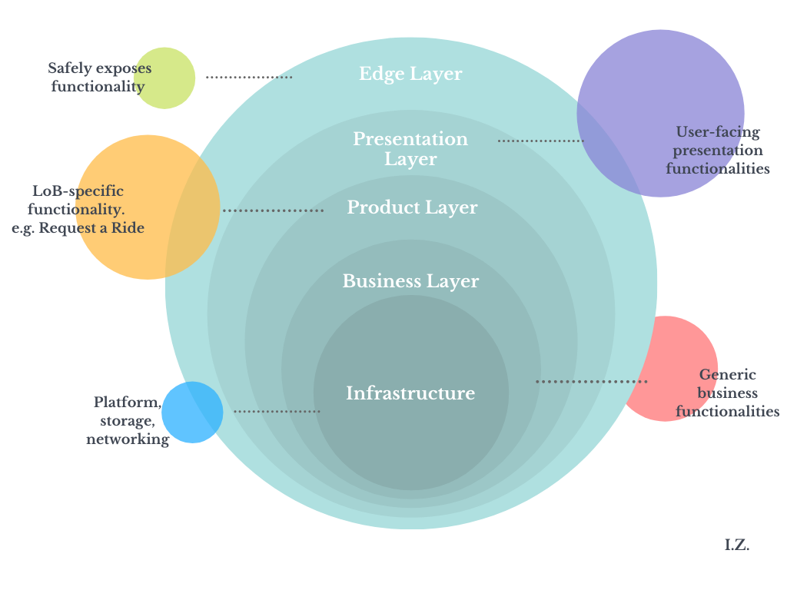
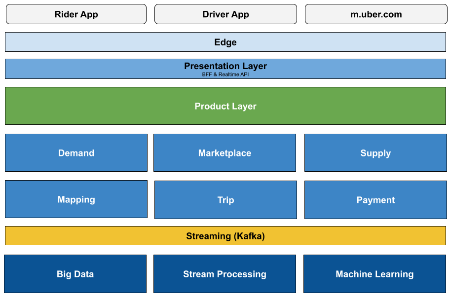
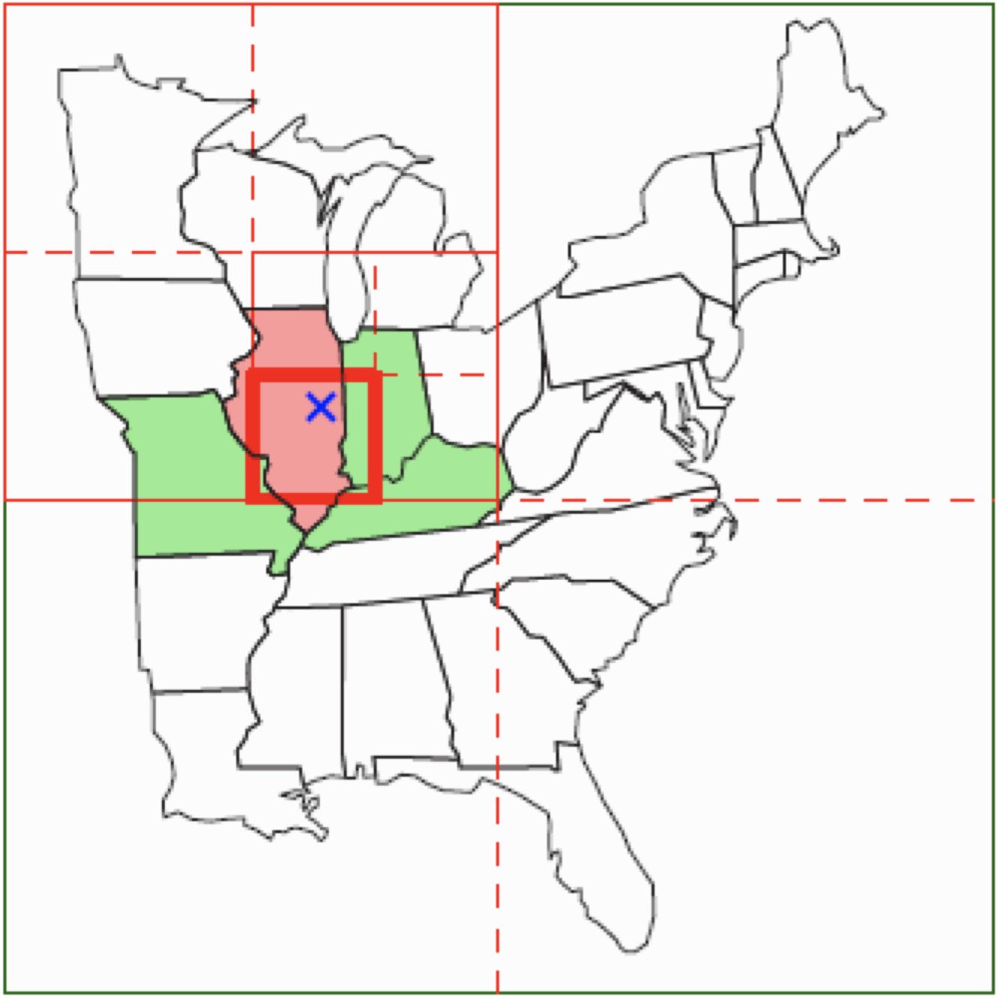

# Design Uber, a ride-hailing system

## Challenge

Have you ever wondered what goes behind the scenes when you simply tap to request an Uber ride, get matched with a driver, to get you from one location to another, all through your mobile device?

Let’s design the architecture for a ride-hailing system like Uber or Lyft!

### Requirements
- A rider requests a ride to their chosen location
- The rider is matched with a driver/ride who accepts to take the ride, and starts to see trip updates on a map
- Driver drops the rider off at their chosen destination and the system charges the rider.
- Routes are recorded and persisted for safety and to enable the experience.
- The system should determine and notify nearby drivers within less than 100ms

### Scale of the System
- 500 million riders
- 10 million drivers
- 1 million concurrent users
- 25 million trips daily

# Proposal

## Data Modeling
Listing a few core entities in a ride-hailing system are:
- **User**: Can be a rider or a driver
- **Trip**: A trip has start and drop-off locations, time, rider and driver info, and is associated with route information. A trip has multiple states, like when it is requested, while it is in-progress, and when completed and paid.
- **Geo-Point**: A coordinate pair of latitude and longitude.
- **Place**: Represented by a geo-point and point of interest, address-like information.
- **Payment Information**

## Capacity Planning
- Trip requests throughput = 25m / 24 / 60 / 60 = ~290 Trip request/second
- Trips storage requirement = 10kb * 25m * 360 days * 5 years = 419 TB
- Combined user storage: 510m * 5kb = ~2.5 TB

## Uber Architecture: Curiosities satisfied from Uber's Engineering Block

Uber utilizes what they call in their Engineering blog a [Domain-Oriented Microservice Architecture](https://eng.uber.com/microservice-architecture/), behind a layered architecture.

### Ground rules of Uber’s Domain-Oriented Microservice Architecture

1. **Domain-oriented functionalities**: Rather than orienting around singular microservices, Uber orients around groupings of related microservices, called Domains.
Layer Design: Uber creates layered groups of domains. The layer that the domain belongs to establishes what dependencies the microservices within that domain are allowed to take on.
3. **Single interface of domain access**: Uber exposes clean interfaces for domains that are treated as single points of access into the domain.
4. **Domain decoupling**: Each domain should be agnostic and independent of other domains. No hard-coding in domain code or data models to enable extended functionality. Instead, Uber provides extension architecture to support well-defined and reusable extension points for a given domain.

### Domain-Orientation
Uber structures groups of related microservices, related through logical grouping of goal and functionality. Domains shouldn’t necessarily follow company structure. In fact, such a limitation is common suboptimal behavior, where teams force domains to follow communication between their organizations.

### Layer Design
As domains move from a lower to a higher layer, they impact fewer services in the case of an outage and represent more specific product use cases. Each layer is isolated and independent of the other layers, and communicates with other layers’ components only downwards through well-defined interfaces.

Functionality at the lower layers have more dependents, i.e. layers above them. As a result, these represent a more general set of business functionality, typically have a larger impact in case of failure.

#### Edge Layer
This is the gateway the safely exposes user functionality to the outside world, to mobile apps and other clients.

#### Presentation Layer
Serves client-specific use cases in Uber client apps. API technology options here are:

- **Resource Oriented APIs**, which have been around for long and are well understood. WebSockets can be utilized for real-time communication. REST is great as well, especially for the API discoverability it brings, but these are more difficult to implement abiding by the specification properly.
- **GraphQL** lends itself well to client-serving orchestration of queries, mutations and subscriptions, made easy and popular with Apollo.
- **gRPC**, a modern, optimal, feature-rich RPC framework built by Google, uses [Protocol Buffers](https://developers.google.com/protocol-buffers) binary representation of data, and supports multiplexing and streaming out of the box, which would elegantly enable realtime use cases. Client and Server support is vast, through gRPC’s code generation functionality. Firebase and [Firestore utilize gRPC](https://github.com/googleapis/googleapis/blob/master/google/firestore/v1/firestore.proto) under the hood in its client SDK’s and server communication.

#### Product Layer
This layer houses services and functionalities that enable line-of-business-specific use-cases, such as Mobility, Delivery and Freight. More on those domains further below.

#### Business Layer
Provides common, core functionality that Uber can use for any product or use case. These functionalities are generic and are not specifically designed for particular line of business.

#### Infrastructure Layer
Provides shared platform infrastructure components, like networking, streaming, storage, machine learning, AI infrastructure.

## Design for Uber Architecture
Putting together the above ground rules, and thinking in DDD fashion about the Uber problem, we come to the following block diagram.

## Uber Business Domains

### User Management
Allows capabilities like add and retrieve users, and update user information.

### Demand
Manages requests for service, e.g. a request for a ride, by a given user at a given location.

### Supply
Manages units of supply, which are service providers available at a given time to review, accept and fulfill a unit of work (a Trip).

### Marketplace
Defines available services for a given context (e.g. city), and matches Trip requests with Supply for fulfillment.

### Trip
Used to create a Trip, which is a unit of fulfillment first created based on Marketplace matching, and later retrieved and managed within this domain.

### Mapping
Manages map data, routing, ETA computation, and systems for collecting and recommending addresses and locations.

### Payment
Initiates payment from rider’s payment instrument into Supply’s account, usually starts based after Trip completion event.

## Uber Product Domains
These domains represent and expose specific lines of business’ functionalities, while we are most concerned, in this scope, with functionalities such as “Request a Ride” within the Mobility domain, we will layout current Uber lines, that would live in the Product Layer and make use of common functionality within the lower Business Layer.

### Mobility
The popular ride-hailing line of business. Matches riders seeking a ride, of different product types like UberX, Pool, and Comfort.

### Delivery
Uber’s Delivery domain, a.k.a. Uber Eats, lets users order meals from restaurants remotely for either pickup or delivery. If they opt for delivery, an Uber driver nearby — in a car, on a bike, or on a scooter — will pick the order up from the restaurant and bring it to the customer.

### Freight
Uber Freight connects truck drivers to shippers seeking to transport freight, in the same way that its Mobility business connects drivers with riders.

## Challenges of Scale
Building Uber to handle planetary scale is a super interesting challenge that would go through years of evolution and re-engineering cycles.

### Scaling Fulfillment Capabilities
For millions of concurrent participants in the marketplace, Uber fulfillment capabilities mainly capture customers’ requests (demand) and fulfill them by matching them with the right service providers (supply).

Addressing scalability of such a large-scale system requires an intricate tradeoff between availability and consistency.

#### Proximity-Influenced Matching of Demand with Supply
Uber clearly matches available service-providers with nearby service seekers.
They do this very promptly, efficiently, and concurrently for a large scale of traffic.

To be able to do that, Uber actively maintains and indexes location of participants, and to determine candidate service providers in proximity of a given demand unit, Uber may utilize one of the following geolocation proximity solutions.

Diagram: A Quad Tree represented by grid on a map. [Source](https://www.cs.tau.ac.il/~haimk/seminar12b/Quadtrees.pdf)

1. [Quad Trees](https://en.wikipedia.org/wiki/Quadtree): A quad-tree is a tree data structure in which each node has zero or four children. It enables recursively dividing a flat 2-D space into four quadrants. Enables O(log(N)) look ups.
2. [Hilbert Space-Filling Curves](https://en.wikipedia.org/wiki/Space-filling_curve): In a nutshell, this is a way to convert a 2-D space into, and index coordinates, as 1-D ranges. This provides simple and efficient geospatial queries.
3. [Google S2](https://s2geometry.io/): A library for spherical geometry. S2 is designed to have good performance on large geographic datasets. With S2, it is fast to find objects that are near each other. Most operations are accelerated using an in-memory edge index data structure.
4. [Uber H3](https://github.com/uber/h3): H3 is a geospatial indexing system using a hexagonal grid that can be (approximately) subdivided into finer and finer hexagonal grids, combining the benefits of a hexagonal grid with S2’s hierarchical subdivisions.

Diagram: Uber H3 enables users to partition the globe into hexagons for more accurate analysis. [Source](https://eng.uber.com/h3/)

For more on the nearby places search topic, check the proposal [Geo-Proximity Searching](/challenges/nearby-places/proposals/IbrahimZananiri).

## Evolution of Uber Fulfillment Capabilities

### Monolith Application
At Inception: One or two main services, handling rider and driver requests and enabling their use cases.

### Distributed, Scalable and Highly-Available System
2014: Utilizing [RingPop](https://eng.uber.com/ringpop-open-source-nodejs-library/), Uber managed to scale their fulfillment capabilities, with distributed systems that detect and handle their own failures, scaling and distributing load seamlessly to maintain high availability. A stark example of a service utilizing RingPop for scale was their geospatial index.

RingPop is a library that allows application developers to write scalable services from the get-go. It maintains a consistent hash ring, by utilizing [Consistent Hashing](https://www.toptal.com/big-data/consistent-hashing) to distribute load and recover from node failures, [SWIM gossip protocol](https://www.cs.cornell.edu/projects/Quicksilver/public_pdfs/SWIM.pdf) to communicate between, discover, and remove nodes, and brings built-in request forwarding capability, which enables clients to simply get their answers from any node.

In their fulfillment services, Demand and Supply, Uber typically employed RingPop for scaling in-memory stores, and Redis and/or Cassandra for persistence. This traded availability and latency for consistency…

### Distributed, Extensible, Highly-Available & Consistent System
2021: Further challenges of scale, and pains from the previous system, where maintaining a consistent state was only achieved on a best-effort basis and lack of atomicity across entities and services meant that reconciliation was needed when later operations failed brought Uber to a large-scale, cross-team fulfillment [rearchitecture](https://eng.uber.com/fulfillment-platform-rearchitecture/) exercise. This initiative lasted two years, involved 30+ teams and 100+ engineers working as a virtual team to make many key technical and prioritization decisions concurrently. The new system comprised:

- **[NewSQL](https://en.wikipedia.org/wiki/NewSQL)** solution for getting transactional capabilities while also maintaining horizontal scalability and availability. Uber ended up utilizing Google Cloud Spanner as the primary storage engine for Uber’s fulfillment services, which run in Uber’s operational regions and call Google Cloud to access Cloud Spanner.
- **Transaction Coordinator** exposed through a high-level API that abstracts away transactional consistency efforts.
- **[Statecharts](https://statecharts.dev/)** to describe fulfillment entities’ lifecycles as clear, well-defined state machines.
As we’ve seen from this timeline, as we delve into massively growing scale and complexity of business problems, the plight for achieving highly-scalable architecture is a fascinating, ever-growing challenge.

As we’ve seen from this timeline, as we delve into massively growing scale and complexity of business problems, the plight for achieving highly-scalable architecture is a fascinating, ever-growing challenge.

### Source
This proposal first appeared on Ibrahim's post:
[Design Uber Ride-Hailing System](https://medium.com/@ibrahim.zananiri/design-uber-ride-hailing-system-6b25978f96a3)

---

# Submit Your Design Proposal

1. Fork repo
2. Create your `proposals/{GITHUB_USERNAME}/` directory
3. Write your proposal in README.md
4. Submit a PR for review!

More details on [/challenges/CONTRIBUTING.md](/challenges/CONTRIBUTING.md)
